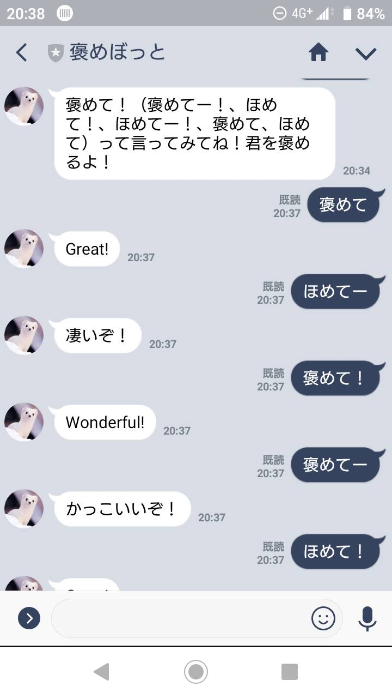

# homerubot
## Date
Creation Date：2/19  
Update Date：2/22

## Overview
This LINEBot name is "homebot".   
The meaning of this name is to praise.  
Japanese is "褒めぼっと".

### How to Use 
If you have a LINE account...  
You can use it by reading the QR code in LINE.  

### LINE Screen

 
 Input "褒めて！".  
 Praise words will be replied.

## Dependency
Programming Language：JavaScript  
Cloud Application Platform：Heroku(PaaS)  
Used library：Node.js(On GitHub)  

## Setup
### preparation
It is necessary to register GitHub Account, Heroku Account, LINEDevelopers Account.

